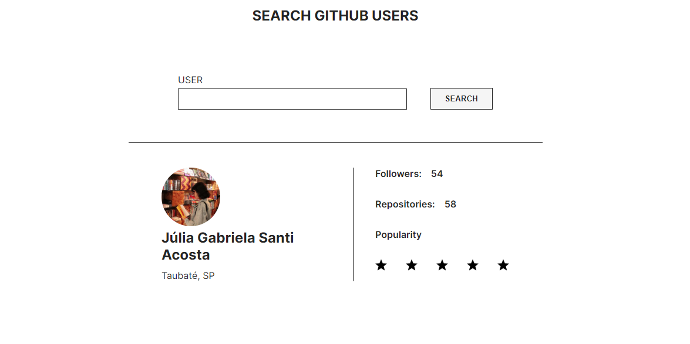

# GitHub User Search

## Descrição

Este projeto é uma aplicação React que permite aos usuários pesquisar perfis de usuários no GitHub. Ele oferece uma interface simples para inserir um termo de busca e exibir os resultados correspondentes.

[Acesse o projeto - Github user explorer](https://github-user-explorer-olive.vercel.app/)



## Recursos

- Pesquisa de usuários do GitHub.
- Exibição de resultados com informações do perfil do usuário.
- Responsivo e interativo.
- Validação de entrada de busca.
- Ranking de popularidade do Github

## Tecnologias Utilizadas

- React
- TypeScript
- CSS Modules

## Instalação

Para instalar o projeto, siga estes passos:

1. Clone o repositório:

   ```bash
   git clone https://github.com/gsajulia/github-user-explorer.git
   ```

2. Instalação das dependências:

   ```bash
   npm install
   ```

3. Iniciar o servidor:

   ```bash
   npm run dev
   ```
